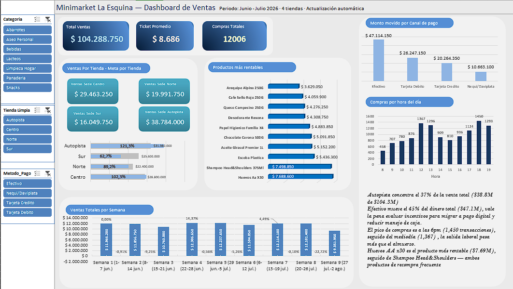

# Minimarket La Esquina — Reportería Automatizada en Excel

Sistema de reportería automatizada para una cadena de minimarket ficticia (4
sedes), construido **100% en Excel** (Power Query + fórmulas + Tablas
Dinámicas), pensado para el tipo de pyme que aún no justifica una herramienta
de BI dedicada pero necesita dejar de armar reportes a mano.

## El problema que resuelve

Cada tienda exporta un CSV diario desde su punto de venta. Sin automatización,
alguien tiene que abrir 4+ archivos por día, pegarlos en un consolidado,
revisar errores a ojo, y armar un resumen para gerencia — un proceso lento y
propenso a errores. Este proyecto reemplaza ese proceso manual por un
pipeline que se actualiza con un clic.

## Qué hace el sistema

1. **Ingesta automática** — Power Query lee todos los CSV de una carpeta
   (sin importar cuántos archivos nuevos lleguen) y los consolida en una
   sola tabla.
2. **Limpieza y recuperación de datos** — no solo detecta errores, los
   **resuelve** cuando es matemáticamente posible (ver
   [`docs/pipeline_power_query.md`](docs/pipeline_power_query.md) para el
   detalle completo de cada regla).
3. **Dashboard interactivo** — KPIs, cumplimiento de meta por tienda,
   ventas por categoría/producto/hora/semana, segmentadores conectados, y
   panel de calidad de datos.

## Capturas



## Estructura del repositorio

```
├── data/
│   └── generar_dataset.py      # Genera el dataset sintético (solo stdlib de Python)
├── docs/
│   └── pipeline_power_query.md # Documentación de la lógica de limpieza en M
├── excel/
│   └── Minimarket_La_Esquina.xlsx  # Workbook final
└── screenshots/
    └── dashboard_v1.png
```

## Cómo reproducir el dataset

```bash
python3 data/generar_dataset.py
```

Genera 244 archivos CSV (61 días × 4 tiendas, junio-julio 2026) en
`data/dataset_minimarket/`, con errores intencionales en proporciones
controladas (duplicados, texto sucio, valores inválidos, fechas fuera de
rango) para poner a prueba el pipeline de limpieza.

## Decisiones de diseño

- **Power Query en vez de solo fórmulas de Excel**: las fórmulas atadas a
  rangos fijos se rompen cuando los datos crecen. Power Query se adapta
  automáticamente al tamaño de los datos con cada actualización — sin tocar
  una sola fórmula.
- **Dos consultas separadas** (`Import_POS_Diario` / `Staging_Limpio`): la
  ingesta y la lógica de negocio están desacopladas, para que cada una se
  pueda modificar sin afectar a la otra.
- **Errores resueltos, no solo descartados**: cuando otra columna permite
  inferir el valor correcto sin ambigüedad (ej. `Total = Cantidad × Precio`),
  el pipeline recupera el dato en vez de perderlo. Cuando no hay forma
  confiable de inferirlo (fecha corrupta, fila duplicada), se excluye
  explícitamente — nunca se inventa información.
- **Precios fijos por tienda-producto**: el precio de un producto no cambia
  transacción a transacción — solo puede variar entre sedes. Esto evita sesgos
  en cualquier análisis de precio promedio o detección de anomalías.

## Próximos pasos (fase 2, en construcción)

- Automatización con VBA: botón de importación con validación en tiempo
  real, registro de errores en `Log_Validacion`, y alertas automáticas por
  correo cuando una tienda no cumple su meta diaria.

## Stack

Excel 2019 · Power Query (M) · Python 3 (solo para generar el dataset
sintético, no es parte del sistema en producción)

---

*Proyecto de portafolio construido como parte de mi preparación para roles de
Data Analyst.*
